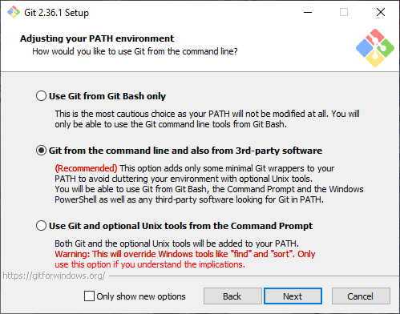
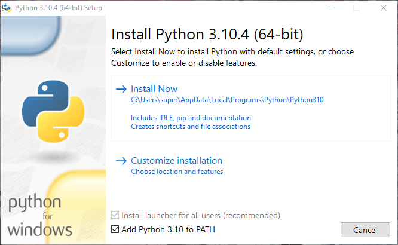

# Auto Course Checker/Registrar

> A CLI/GUI script to check/registrar courses from [KFUPM Course Offering](https:/registrar.kfupm.edu.sa/courses-classes/course-offering/)

## Prerequisites

To run this script you need to have:

- [Git](https://git-scm.com/downloads/)
    <details>
    <summary><strong>Note for Windows users</strong></summary>

    if you are using windows (without [`WSL`](https://docs.microsoft.com/en-us/windows/wsl/install)) you need to select this option while installing Git:
    
    </details>

- [Python3.7+](https://www.python.org/downloads/)
    <details close>
    <summary><strong>Note for Windows users</strong></summary>

    if you are using windows (without [`WSL`](https://docs.microsoft.com/en-us/windows/wsl/install)) you need to select this option while installing Python:
    
    </details>

- [Git Bash](https://git-scm.com/download/win) or [WSL](https://docs.microsoft.com/en-us/windows/wsl/install) or [Cygwin](https://www.cygwin.com/install.html) or [MSYS2](https://www.msys2.org/index.html) for windows users

## Installation

- Open CMD/Terminal

- Clone the repository to your device:

    ```sh
    git clone https://github.com/Yokozuna59/auto-registrar.git
    ```

- Change directory to cloned project:

    ```sh
    cd auto-registrar
    ```

- Install dependencies:

  - Linux & MacOS & WSL:

    ```sh
    chmod +x install.sh
    ./install.sh
    ```

  - Windows:
    You cant run `install.sh` directly, one of the follwoing apps will do it for you:

    [Git Bash](https://git-scm.com/download/win) or [WSL](https://docs.microsoft.com/en-us/windows/wsl/install) or [Cygwin](https://www.cygwin.com/install.html) or [MSYS2](https://www.msys2.org/index.html).

    If you installed WSl before and **not** using it right now, you can run the following command:

    ```sh
    bash install.sh
    ```

    If you installed `WSL` of `Git Bash` or  `Cygwin` or `MSYS2` before, run one of them the you can run the following command:

    ```sh
    ./install.sh
    ```

- Run the project:

    ```sh
    python main.py
    # or python3 main.py
    ```
