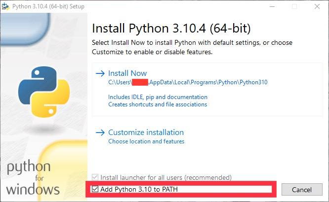
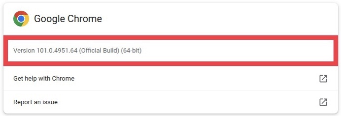
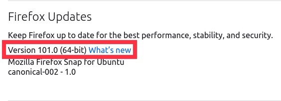
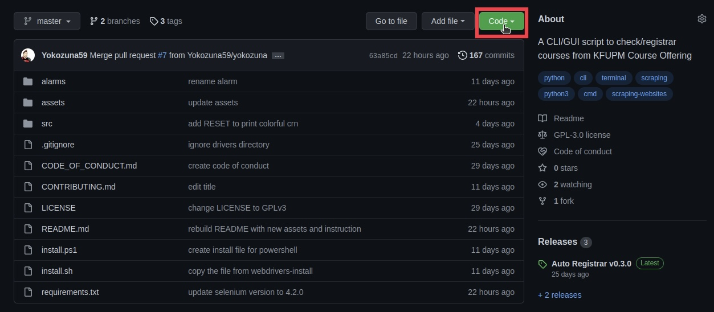
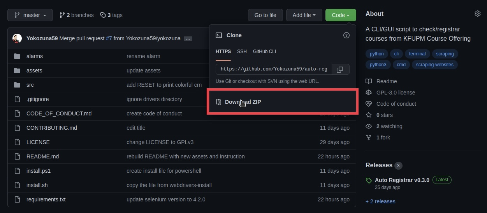

# Auto Course Checker/Registrar

> A CLI/GUI script to check/register courses from KFUPM [Course Offering](https:/registrar.kfupm.edu.sa/courses-classes/course-offering/) and [Banner 8](https://banner8-ssb.kfupm.edu.sa/PROD9/twbksite.P_DispSiteMap?menu_name_in=bmenu.P_MainMnu&depth_in=2&columns_in=3) and [Banner 9](https://banner9-registration.kfupm.edu.sa/StudentRegistrationSsb/ssb/registration/registration).

## Prerequisites

You don't need to install any prerequisites, because [`install.sh`](install.sh) script (for MacOS & Linux & WSL) and [`install.ps1`](install.ps1) (for Windows) will install all the required dependencies for you ([go to Installation](#installation)), but you can install the dependencies manually if you want.

### Minimal Manual Prerequisites

1. [Python3.7+](https://www.python.org/downloads/)
    **Note:** Make sure you install the correct version. You can check the version of Python you have installed by running `python --version` or `python3 --version` in the command prompt or terminal.

    <details close>
    <summary>Linux</summary>
    <table>
        <tr>
            <td><strong>Package Manager</strong></td>
            <td><strong>Distributions</strong></td>
            <td><strong>Command</strong></td>
            <strong></strong>
        </tr>
        <tr>
            <td>apk</td>
            <td>Alpine Linux</td>
            <td><code>sudo apk add --no-cache python3 py3-pip</code></td>
        </tr>
        <tr>
            <td>apt-get</td>
            <td>Debian, Ubuntu, Kali... etc</td>
            <td><code>sudo apt-get install python3 python3-pip</code></td>
        </tr>
        <tr>
            <td>dnf</td>
            <td>CentOS, Fedora, Oracle Linux... etc</td>
            <td><code>sudo dnf install python3 python3-pip</code></td>
        </tr>
        <tr>
            <td>pacman</td>
            <td>Arch Linux, Manjaro, Antergos... etc</td>
            <td><code>sudo pacman -S python python-pip</code></td>
        </tr>
        <tr>
            <td>yum</td>
            <td>CentOS, Fedora, Oracle Linux... etc</td>
            <td><code>sudo yum install python3 python3-pip</code></td>
        </tr>
        <tr>
            <td>zypper</td>
            <td>openSUSE, SUSE Linux... etc</td>
            <td><code>sudo zypper install python3 python3-pip</code></td>
        </tr>
    </table>
    </details>

    <details close>
    <summary>MacOS</summary>
    <table>
        <tr>
            <td><strong>Method</strong></td>
            <td><strong>Command</strong></td>
        </tr>
        <tr>
            <td>Official Python Website</td>
            <td><a href="https://www.python.org/downloads/macos">https://www.python.org/downloads/macos/</a></td>
        </tr>
        <tr>
            <td>brew</td>
            <td><code>brew install python</code></td>
        </tr>
        <tr>
            <td>MacPorts</td>
            <td><code>sudo port install python310</code></td>
        </tr>
    </table>
    </details>

    <details close>
    <summary>Windows</summary>
    <ul>
        <li>From the official <a href="https://www.python.org/downloads/windows/">Python website</a>
        <p><strong>Note:</strong> Make sure to select this option while installing from official website:<br>
        </p></li>
        <li>Using <a href="https://www.msys2.org/">MSYS2</a>: <code>pacman -S python3 python3-pip</code></li>
        <li>Using <a href="https://docs.microsoft.com/en-us/windows/wsl/">WSL</a>
            <table>
                <tr>
                    <td><strong>Package Manager</strong></td>
                    <td><strong>Distributions</strong></td>
                    <td><strong>Command</strong></td>
                    <strong></strong>
                </tr>
                <tr>
                    <td>apk</td>
                    <td>Alpine Linux</td>
                    <td><code>sudo apk add --no-cache python3 py3-pip</code></td>
                </tr>
                <tr>
                    <td>apt-get</td>
                    <td>Debian, Ubuntu, Kali... etc</td>
                    <td><code>sudo apt-get install python3 python3-pip</code></td>
                </tr>
                <tr>
                    <td>dnf</td>
                    <td>CentOS, Fedora, Oracle Linux... etc</td>
                    <td><code>sudo dnf install python3 python3-pip</code></td>
                </tr>
                <tr>
                    <td>pacman</td>
                    <td>Arch Linux, Manjaro, Antergos... etc</td>
                    <td><code>sudo pacman -S python python-pip</code></td>
                </tr>
                <tr>
                    <td>yum</td>
                    <td>CentOS, Fedora, Oracle Linux... etc</td>
                    <td><code>sudo yum install python3 python3-pip</code></td>
                </tr>
                <tr>
                    <td>zypper</td>
                    <td>openSUSE, SUSE Linux... etc</td>
                    <td><code>sudo zypper install python3 python3-pip</code></td>
                </tr>
            </table>
        </li>
    </ul>
    </details>

2. Browser: [Chrome](https://www.google.com/chrome/) or [Firefox](https://www.mozilla.org/en-US/firefox/new/).
    Currently, the script only supports Chrome and Firefox. If you want to use other browsers, you could open an issue on [GitHub](https://github.com/Yokozuna59/auto-registrar/issues).

3. Browser Drivers
    **Note:** You have to create `drivers` folder and move the drivers to it then move the whole folder to the project.
    e.g. `drivers/chromedriver.exe` and `drivers/geckodriver.exe`

    <details close>
    <summary>Chrome - (<a href="https://chromedriver.chromium.org/downloads">Download</a>)</summary>
        <p><strong>Note:</strong> Make sure you install the correct version. You can find the version of your chrome browser by searching <code>chrome://settings/help</code> in your chrome browser.</p>
        
    </details>

    <details close>
    <summary>Firefox - (<a href="https://github.com/mozilla/geckodriver/releases/latest">Download</a>)</summary>
        <p><strong>Note:</strong> Make sure you install the correct version. You can find the version of your firefox browser by searching <code>about:preferences#general</code> in your firefox browser and scroll down until you found <code>Firefox Updates</code>.</p>
        <br>
        <p>You can check what version works with your firefox driver through this website: <a href="https://firefox-source-docs.mozilla.org/testing/geckodriver/Support.html">https://firefox-source-docs.mozilla.org/testing/geckodriver/Support.html</a></p>
    </details>

## Installation

### Project Installation

#### Command-Line Interface (CLI)

| Method | Command |
|:------:|:--------|
| **cmd** | `curl.exe -SLfso auto-registrar.zip https://github.com/Yokozuna59/auto-registrar/archive/refs/heads/master.zip && compact /u auto-registrar.zip /Q && del auto-registrar.zip` |
| **curl** | `curl -SLfso auto-registrar.zip https://github.com/Yokozuna59/auto-registrar/archive/refs/heads/master.zip && unzip auto-registrar.zip && rm auto-registrar.zip` |
| **git** | `git clone https://github.com/Yokozuna59/auto-registrar.git` |
| **powershell** | `Invoke-WebRequest -URI "https://github.com/Yokozuna59/auto-registrar/archive/refs/heads/master.zip" -OutFile "auto-registrar.zip" && Expand-Archive -Path "auto-registrar.zip" -DestinationPath (Get-Location).Path -Force && Remove-Item -Path "auto-registrar.zip" -Force` |
| **wget** | `wget -O auto-registrar.zip https://github.com/Yokozuna59/auto-registrar/archive/refs/heads/master.zip --quiet && unzip auto-registrar.zip && rm auto-registrar.zip` |

#### Graphical User Interface (GUI)





### Requirements Installation

Change directory to the `auto-registrar` folder:

```bash
cd auto-registrar
```

| Platform | Command |
|:----------------:|:-------------------------------|
| **Linux** | `chmod +x install.sh && ./install.sh` |
| **MacOS** | `chmod +x install.sh && ./install.sh` |
| **WSL**   | `chmod +x install.sh && sed -i 's/\r$//' install.sh && ./install.sh` |
| **PowerShell** | `Set-ExecutionPolicy -ExecutionPolicy Bypass && .\install.ps1` |

## Run the Script

- Open Command Prompt or Terminal in project directory

- It would be better to use Virtual Environment.

    | Platform | Command |
    |:----------------:|:-------------------------------|
    | **Linux** | `python3 -m venv .venv && source .venv/bin/activate` |
    | **MacOS** | `python3 -m venv .venv && source .venv/bin/activate` |
    | **WSL**   | `python3 -m venv .venv && source .venv/bin/activate` |
    | **PowerShell** | `python -m venv .venv && .venv/Scripts/activate.ps1` |

- Install requirements

    ```bash
    pip install -r requirements.txt
    # or pip3 install -r requirements.txt
    ```

- Run the script:

    ```bash
    python src/main.py
    # or python3 src/main.py
    ```

- To deactivate the virtual environment:

    ```bash
    deactivate
    ```
